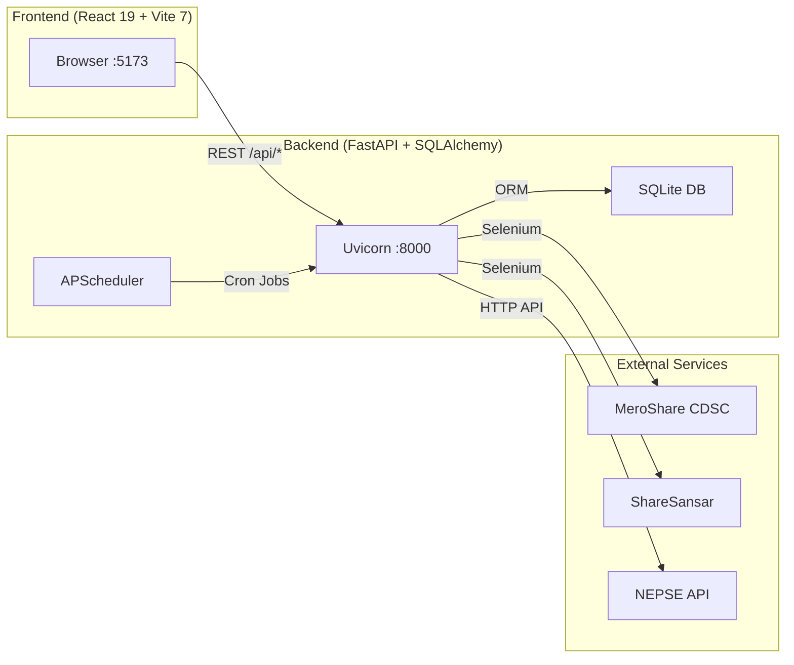
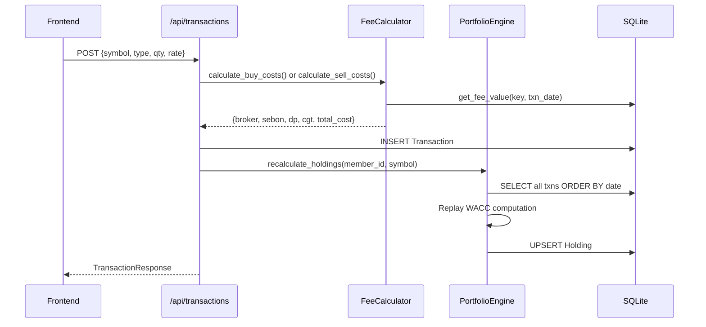
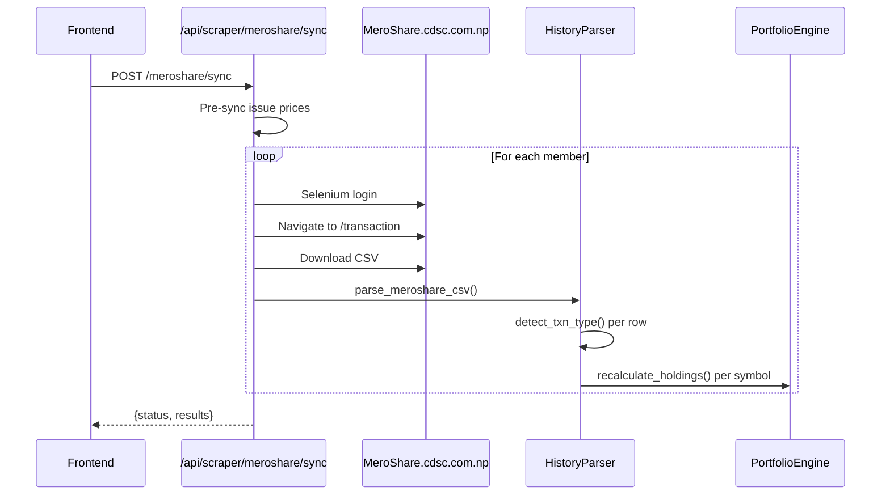

# Nepal Portfolio Manager — Comprehensive Project Audit & Documentation

> **Audit Date**: 2026-04-01  
> **Codebase Scope**: Full-stack (Python/FastAPI backend + React/Vite frontend)  
> **Database**: SQLite (`portfolio.db`, ~780 KB)

---

## Table of Contents

1. [Project Overview](#1-project-overview)
2. [Architecture & Tech Stack](#2-architecture--tech-stack)
3. [Backend — Deep Dive](#3-backend--deep-dive)
   - [Entry Point & Lifecycle](#31-entry-point--lifecycle)
   - [Configuration](#32-configuration)
   - [Database Layer](#33-database-layer)
   - [Models (ORM)](#34-models-orm)
   - [Schemas (Pydantic)](#35-schemas-pydantic)
   - [API Routes](#36-api-routes)
   - [Services (Business Logic)](#37-services-business-logic)
   - [Scrapers](#38-scrapers)
   - [Utilities](#39-utilities)
   - [Standalone Scripts](#310-standalone-scripts)
4. [Frontend — Deep Dive](#4-frontend--deep-dive)
   - [Entry Point & Providers](#41-entry-point--providers)
   - [App Shell & Routing](#42-app-shell--routing)
   - [Pages](#43-pages)
   - [Components](#44-components)
   - [API Service Layer](#45-api-service-layer)
   - [Styling](#46-styling)
5. [Data Flow Diagrams](#5-data-flow-diagrams)
6. [Issues & Findings](#6-issues--findings)
   - [🔴 Critical Issues](#-critical-issues)
   - [🟠 High-Severity Issues](#-high-severity-issues)
   - [🟡 Medium-Severity Issues](#-medium-severity-issues)
   - [🟢 Low-Severity / Improvements](#-low-severity--improvements)
7. [Performance Bottlenecks](#7-performance-bottlenecks)
8. [Security Assessment](#8-security-assessment)
9. [Dependency Audit](#9-dependency-audit)
10. [Recommendations Summary](#10-recommendations-summary)

---

## 1. Project Overview

**Nepal Portfolio Manager** is a personal-use, full-stack web application for tracking investments in the Nepali stock market (NEPSE). It supports:

- **Multi-member portfolios** — track shares for multiple family members
- **Dual WACC engine** — True WACC (cash basis) and Tax WACC (CDSC/MeroShare rules where bonus = Rs. 100)
- **Automated MeroShare sync** — Selenium-based headless scraping of transaction history
- **Live price feeds** — ShareSansar price scraping + Mutual Fund NAV scraping
- **IPO automation** — Apply for IPOs via MeroShare for multiple members
- **DP statement reconciliation** — Import SIP data from NMBSBFE (PDF), NIBLSF (CSV), and NI31 (XLSX)
- **Computed portfolio history** — Historical performance charts with NEPSE index benchmarking
- **Fee calculator** — Configurable, date-versioned SEBON fee structure
- **Export/Import** — Excel and CSV export; native CSV import for portability
- **Background scheduler** — APScheduler for automated NAV refresh, daily snapshots, and backups

---

## 2. Architecture & Tech Stack



| Layer | Technology | Version |
|-------|-----------|---------|
| **Backend Framework** | FastAPI | 0.115.6 |
| **ASGI Server** | Uvicorn | 0.34.0 |
| **ORM** | SQLAlchemy | 2.0.36 |
| **Database** | SQLite | — |
| **Validation** | Pydantic | 2.10.4 |
| **Scheduler** | APScheduler | 3.10.4 |
| **Scraping** | Selenium + BeautifulSoup4 | 4.41.0 / 4.12.3 |
| **PDF Parsing** | pdfplumber | 0.11.9 |
| **Excel** | openpyxl, pandas | 3.1.5 / 2.2.3 |
| **Encryption** | cryptography (Fernet) | 44.0.0 |
| **Math** | scipy (Newton-Raphson for XIRR) | 1.17.1 |
| **Frontend UI** | React + Ant Design 6 | 19.2.0 / 6.3.1 |
| **State Management** | TanStack React Query | 5.90.21 |
| **Charts** | Recharts | 3.7.0 |
| **Build Tool** | Vite | 7.3.1 |
| **HTTP Client** | Axios | 1.13.6 |

---

## 3. Backend — Deep Dive

### 3.1 Entry Point & Lifecycle

**File**: [main.py](file:///d:/Projects/Portfolio/backend/app/main.py)

The FastAPI app uses the modern `lifespan` async context manager:

- **Startup**:
  1. `init_db()` — Create all SQLAlchemy tables via `Base.metadata.create_all()`
  2. `seed_fee_config(db)` — Insert historical SEBON fee rates if not present
  3. `start_scheduler()` — APScheduler background jobs
- **Shutdown**:
  1. `stop_scheduler()` — Graceful shutdown of APScheduler

**Eight API routers** are mounted under `/api/`:
- `members`, `companies`, `transactions`, `portfolio`, `scraper`, `config`, `prices`, `ipo`

**CORS** is configured for `localhost:5173` and `127.0.0.1:5173`.

---

### 3.2 Configuration

**File**: [config.py](file:///d:/Projects/Portfolio/backend/app/config.py)

Uses `pydantic-settings` for environment-based configuration:

| Setting | Default | Notes |
|---------|---------|-------|
| `DEBUG` | `True` | **⚠️ Left on in production** — causes SQLAlchemy echo |
| `DATABASE_URL` | `sqlite:///./portfolio.db` | Relative path |
| `ENCRYPTION_KEY` | `""` | Fernet key for MeroShare credentials |
| `MASTER_PASSWORD` | `admin123` | **⚠️ Hardcoded default** |
| `CORS_ORIGINS` | `localhost:5173` | Dev-only CORS |
| `NEPSE_COMPANY_URL` | nepalstock.com | Used by company scraper |
| `NAV_URL` | sharesansar.com | Used by NAV scraper |
| `MEROSHARE_URL` | meroshare.cdsc.com.np | Used by login automation |

---

### 3.3 Database Layer

**File**: [database.py](file:///d:/Projects/Portfolio/backend/app/database.py)

- Uses SQLAlchemy 2.0 `DeclarativeBase`
- SQLite-specific: `check_same_thread=False` for FastAPI thread pool
- `echo=settings.DEBUG` — **all SQL statements logged when DEBUG=True**
- Session lifecycle managed via `get_db()` dependency generator

---

### 3.4 Models (ORM)

#### 3.4.1 Member & Credentials

**Files**: [member.py](file:///d:/Projects/Portfolio/backend/app/models/member.py)

| Table | Columns | Relationships |
|-------|---------|--------------|
| `members` | id, name (unique), display_name, is_active, last_sync_at, created_at, updated_at | → credentials (1:1), holdings (1:N), transactions (1:N) |
| `meroshare_credentials` | id, member_id (FK unique), dp, username, password_encrypted, crn, txn_pin, apply_unit | → member |

#### 3.4.2 Company

**File**: [company.py](file:///d:/Projects/Portfolio/backend/app/models/company.py)

| Table | Columns |
|-------|---------|
| `companies` | id, symbol (unique), name, sector, instrument, status, email, website, created_at, updated_at |

#### 3.4.3 Transaction

**File**: [transaction.py](file:///d:/Projects/Portfolio/backend/app/models/transaction.py)

| Table | Key Columns |
|-------|-------------|
| `transactions` | id, member_id (FK, indexed), company_id (FK), symbol (indexed), txn_type, quantity, rate, amount, broker_commission, sebon_fee, dp_charge, name_transfer_fee, cgt, total_cost, wacc, tax_wacc, txn_date, source, remarks |
| | **SIP fields**: actual_date, actual_units, nav, charge, is_reconciled |

**TransactionType enum**: IPO, FPO, RIGHT, BONUS, AUCTION, BUY, SELL, TRANSFER_IN, TRANSFER_OUT, MERGE, DEMERGE, DIVIDEND

**TransactionSource enum**: MEROSHARE, MANUAL, SYSTEM

#### 3.4.4 Holding

**File**: [holding.py](file:///d:/Projects/Portfolio/backend/app/models/holding.py)

| Table | Columns |
|-------|---------|
| `holdings` | id, member_id (FK, indexed), company_id (FK), symbol (indexed), current_qty, wacc, tax_wacc, total_investment, updated_at |

#### 3.4.5 Price Models

**File**: [price.py](file:///d:/Projects/Portfolio/backend/app/models/price.py)

| Table | Purpose |
|-------|---------|
| `live_prices` | Latest LTP per company (unique on company_id) |
| `nav_values` | Latest NAV for open-end mutual funds |
| `fee_config` | Date-versioned fee parameters (key-value with effective_from) |
| `issue_prices` | Cached IPO/FPO/Right issue prices |
| `price_history` | Historical daily OHLCV (unique on symbol + date) |
| `index_history` | Historical NEPSE index values (unique on index_name + date) |

#### 3.4.6 Portfolio Snapshot

**File**: [portfolio_snapshot.py](file:///d:/Projects/Portfolio/backend/app/models/portfolio_snapshot.py)

| Table | Columns |
|-------|---------|
| `portfolio_snapshots` | id, member_id (FK), date, total_investment, current_value, unrealized_pnl, holdings_count |

---

### 3.5 Schemas (Pydantic)

| Schema File | Models |
|-------------|--------|
| [member.py](file:///d:/Projects/Portfolio/backend/app/schemas/member.py) | MemberCreate, MemberUpdate, MemberResponse, CredentialCreate, CredentialUpdate, CredentialResponse, MemberCredentialBulk, BulkImportRequest, VerifyPasswordRequest |
| [transaction.py](file:///d:/Projects/Portfolio/backend/app/schemas/transaction.py) | TransactionCreate, TransactionUpdate, TransactionResponse, TransactionListResponse |
| [holding.py](file:///d:/Projects/Portfolio/backend/app/schemas/holding.py) | HoldingResponse (with computed fields: ltp, current_value, unrealized_pnl, pnl_pct, tax_profit, xirr), PortfolioSummary |
| [company.py](file:///d:/Projects/Portfolio/backend/app/schemas/company.py) | CompanyResponse, CompanyListResponse |
| [price.py](file:///d:/Projects/Portfolio/backend/app/schemas/price.py) | LivePriceResponse, NavValueResponse, FeeConfigResponse, FeeConfigUpdate, MergedPriceResponse |

---

### 3.6 API Routes

#### `/api/members` — [members.py](file:///d:/Projects/Portfolio/backend/app/api/members.py)

| Method | Path | Description |
|--------|------|-------------|
| GET | `/` | List all members |
| POST | `/` | Create member |
| GET | `/{id}` | Get member |
| PUT | `/{id}` | Update member |
| DELETE | `/{id}` | Delete member + cascade |
| POST | `/verify-password` | Verify master password |
| GET | `/export-credentials` | Export all credentials (decrypted!) |
| POST | `/import-credentials` | Bulk import members + credentials |
| POST | `/{id}/credentials` | Set credentials + auto-sync |
| GET | `/{id}/credentials` | Get credentials (masked) |
| GET | `/{id}/credentials/decrypted` | Get credentials with plaintext password |
| DELETE | `/{id}/credentials` | Delete credentials |

#### `/api/transactions` — [transactions.py](file:///d:/Projects/Portfolio/backend/app/api/transactions.py)

| Method | Path | Description |
|--------|------|-------------|
| GET | `/` | List with pagination (`limit`/`offset`) & filters |
| POST | `/` | Create manual transaction (auto-calculates fees) |
| POST | `/upload` | Upload MeroShare CSV |
| POST | `/import-native` | Import portfolio-format CSV |
| POST | `/upload-dp` | Upload DP statement (PDF/CSV/XLSX) |
| PUT | `/{id}` | Update transaction + recalculate |
| DELETE | `/{id}` | Delete transaction + recalculate |

#### `/api/portfolio` — [portfolio.py](file:///d:/Projects/Portfolio/backend/app/api/portfolio.py)

| Method | Path | Description |
|--------|------|-------------|
| GET | `/summary` | Portfolio P&L summary |
| GET | `/holdings` | List holdings with live P&L |
| GET | `/history` | Snapshot-based history (for charts) |
| POST | `/snapshot` | Manual snapshot trigger |
| GET | `/closed-positions` | Fully liquidated positions with realized P&L |
| POST | `/backfill-history` | Download historical prices for all symbols |
| GET | `/computed-history` | Daily portfolio value vs NEPSE index |

#### `/api/prices` — [prices.py](file:///d:/Projects/Portfolio/backend/app/api/prices.py)

| Method | Path | Description |
|--------|------|-------------|
| GET | `/` | Merged LTP + NAV prices for all companies |
| GET | `/issue-price` | Get cached IPO/RIGHT/FPO price |

#### `/api/scraper` — [scraper.py](file:///d:/Projects/Portfolio/backend/app/api/scraper.py)

| Method | Path | Description |
|--------|------|-------------|
| POST | `/companies` | Scrape NEPSE company list |
| POST | `/nav` | Scrape mutual fund NAVs |
| POST | `/prices` | Scrape live share prices |
| POST | `/meroshare/sync` | Sync all/specific members |
| POST | `/issues` | Sync IPO/FPO/Right issue prices |

#### `/api/config` — [config_api.py](file:///d:/Projects/Portfolio/backend/app/api/config_api.py)

| Method | Path | Description |
|--------|------|-------------|
| GET | `/fees` | Get current fee config |
| GET | `/fees/history/{key}` | Get all versions of a fee key |
| PUT | `/fees/{key}` | Update current value |
| POST | `/fees/version` | Add new date-versioned fee rate |

#### `/api/ipo` — [ipo.py](file:///d:/Projects/Portfolio/backend/app/api/ipo.py)

| Method | Path | Description |
|--------|------|-------------|
| GET | `/open` | Fetch open IPOs from MeroShare |
| POST | `/apply` | Start background IPO application job |
| GET | `/status/{job_id}` | Poll job status |

---

### 3.7 Services (Business Logic)

#### 3.7.1 Portfolio Engine — [portfolio_engine.py](file:///d:/Projects/Portfolio/backend/app/services/portfolio_engine.py) (355 lines)

**Core functions**:

- **`recalculate_holdings(db, member_id, symbol)`** — Replays all transactions chronologically to compute:
  - `current_qty`, `wacc` (true WACC), `tax_wacc` (MeroShare WACC)
  - Updates or creates `Holding` record; deletes if qty ≤ 0
  - Also stamps each transaction with its running WACC

- **`calculate_xirr(cashflows)`** — Newton-Raphson solver for XIRR using `scipy.optimize.newton`

- **`get_xirr_for_holding(db, member_id, symbol, current_value)`** — Builds cashflow list from transactions; adds current market value as terminal cashflow

- **`get_portfolio_summary(db, member_id, member_ids)`** — Aggregates all holdings with live prices, computes overall P&L, realized profit, dividend income

#### 3.7.2 Fee Calculator — [fee_calculator.py](file:///d:/Projects/Portfolio/backend/app/services/fee_calculator.py) (335 lines)

Implements Nepal's SEBON fee structure with **historical rate versioning**:

| Fee Component | Logic |
|---------------|-------|
| **Broker Commission** | ≤50k: rate_low%, >50k: rate_high% — 3 historical periods |
| **SEBON Fee** | 0.015% equity, 0.010% mutual fund, 0.005% govt bond |
| **DP Charge** | Rs. 25 per scrip |
| **Name Transfer** | Rs. 5 (buy only) |
| **CGT** | <365 days: 7.5%, ≥365 days: 5.0% |

Uses internal `_FEE_CACHE` dict for per-process caching. Cache cleared on config update.

#### 3.7.3 History Parser — [history_parser.py](file:///d:/Projects/Portfolio/backend/app/services/history_parser.py) (367 lines)

Parses MeroShare CSV exports with:
- **Smart type detection** via `detect_txn_type()` — priority-ordered keyword matching
- Handles credit/debit quantity separation
- Skips SIP symbols (Open-End Mutual Funds) intentionally
- Includes a **repair logic** for corrupted transaction types
- Auto-fetches issue prices from `IssuePrice` table for rate assignment

#### 3.7.4 DP Parser — [dp_parser.py](file:///d:/Projects/Portfolio/backend/app/services/dp_parser.py) (189 lines)

Three parsers for SIP/Mutual Fund statements:

| Format | Source | Parser |
|--------|--------|--------|
| `NMBSBFE` | PDF | `parse_nmbsbfe_pdf()` — regex on pdfplumber text |
| `NIBLSF` | CSV | `parse_niblsf_csv()` — row-by-row CSV parsing |
| `NEW_NI31` | XLSX | `parse_NI31_excel()` — pandas DataFrame |

+ `reconcile_dp_statement()` — deduplication + upsert logic

#### 3.7.5 Native Parser — [native_parser.py](file:///d:/Projects/Portfolio/backend/app/services/native_parser.py) (153 lines)

Imports previously-exported portfolio CSV. Validates member existence before importing.

#### 3.7.6 Portfolio History — [portfolio_history.py](file:///d:/Projects/Portfolio/backend/app/services/portfolio_history.py) (134 lines)

Computes daily portfolio value by replaying all transactions day-by-day against historical price data. Returns portfolio_value, investment_cost, nepse_index, and unrealized_pnl for each day.

#### 3.7.7 History Scraper — [history_scraper.py](file:///d:/Projects/Portfolio/backend/app/services/history_scraper.py) (163 lines)

Downloads historical OHLCV data from NEPSE API (`nepse-scraper` library) for:
- All symbols that appear in transactions
- NEPSE Index (ID 58)

#### 3.7.8 Backup Service — [backup_service.py](file:///d:/Projects/Portfolio/backend/app/services/backup_service.py) (65 lines)

- Creates daily SQLite file copy: `portfolio_YYYYMMDD.db`
- Monthly backups (1st of month) tagged `_monthly` and kept forever
- Daily backups older than 14 days are deleted

#### 3.7.9 IPO Bot — [ipo_bot.py](file:///d:/Projects/Portfolio/backend/app/services/ipo_bot.py) (280 lines)

Selenium-based MeroShare IPO application bot:
- Login with DP/username/password (Select2 dropdown handling)
- Navigate to ASBA page, scrape open issues  
- Fill forms: bank selection, CRN, units, TXN PIN, disclaimer acceptance
- Returns success/error status per application

---

### 3.8 Scrapers

| Scraper | File | Method | Target |
|---------|------|--------|--------|
| **Company List** | [company_scraper.py](file:///d:/Projects/Portfolio/backend/app/scrapers/company_scraper.py) | Selenium + JS extraction | nepalstock.com/company |
| **Live Prices** | [price_scraper.py](file:///d:/Projects/Portfolio/backend/app/scrapers/price_scraper.py) | Selenium + BeautifulSoup | sharesansar.com/today-share-price |
| **NAV** | [nav_scraper.py](file:///d:/Projects/Portfolio/backend/app/scrapers/nav_scraper.py) | Selenium + BeautifulSoup | sharesansar.com/mutual-fund-navs |
| **MeroShare** | [meroshare.py](file:///d:/Projects/Portfolio/backend/app/scrapers/meroshare.py) | Selenium (headless) | meroshare.cdsc.com.np |
| **Issue Prices** | [issue_autoscraper.py](file:///d:/Projects/Portfolio/backend/app/scrapers/issue_autoscraper.py) | HTTP requests (no Selenium!) | sharesansar.com/existing-issues |
| **Issue CSV** | [issue_scraper.py](file:///d:/Projects/Portfolio/backend/app/scrapers/issue_scraper.py) | Selenium | sharesansar.com/existing-issues |
| **Driver Factory** | [driver_factory.py](file:///d:/Projects/Portfolio/backend/app/scrapers/driver_factory.py) | — | Shared headless Chrome with anti-detection |

**Anti-detection**: Real user-agent, `navigator.webdriver` override, automation flags removed.

---

### 3.9 Utilities

| Utility | File | Purpose |
|---------|------|---------|
| **Encryption** | [encryption.py](file:///d:/Projects/Portfolio/backend/app/utils/encryption.py) | Fernet encrypt/decrypt for MeroShare passwords |
| **Scheduler** | [scheduler.py](file:///d:/Projects/Portfolio/backend/app/utils/scheduler.py) | APScheduler with 4 jobs: price refresh (disabled), NAV refresh (18:00 NPT), backup (23:55 NPT), portfolio snapshot (15:30 NPT) |

---

### 3.10 Standalone Scripts

Located in `backend/` root — maintenance/one-off utilities:

| Script | Purpose |
|--------|---------|
| `recalculate_all.py` | Re-process WACC for all member-symbol pairs |
| `resync_holdings.py` | Recalculate + remove ghost holdings |
| `fix_bonus_rates.py` | Fix BONUS transactions with rate=100 or dp=25 to rate=0/dp=0 |
| `cleanup_sips.py` | Delete corrupted SIP transactions from MeroShare source |

---

## 4. Frontend — Deep Dive

### 4.1 Entry Point & Providers

**File**: [main.jsx](file:///d:/Projects/Portfolio/frontend/src/main.jsx)

Provider stack (outermost → innermost):
1. `StrictMode`
2. `QueryClientProvider` — React Query with 30s `staleTime`, 1 retry
3. `BrowserRouter`
4. `ConfigProvider` — Ant Design dark theme with custom tokens:
   - Primary: `#6C5CE7` (purple)
   - Background: `#1a1a2e` / `#0f0f23`
   - Font: Inter

### 4.2 App Shell & Routing

**File**: [App.jsx](file:///d:/Projects/Portfolio/frontend/src/App.jsx)

Layout: `Sider` (240px, dark, collapsible) + `Content`.

| Route | Page | Menu Label |
|-------|------|------------|
| `/` | Dashboard | Dashboard |
| `/holdings` | Holdings | Holdings |
| `/transactions` | Transactions | Transactions |
| `/prices` | Prices | Prices |
| `/apply-ipo` | ApplyIPO | Apply IPO |
| `/upload` | Upload | Sync & Credentials |
| `/settings` | Settings | Settings |

### 4.3 Pages

| Page | File | Size | Purpose |
|------|------|------|---------|
| **Dashboard** | [Dashboard.jsx](file:///d:/Projects/Portfolio/frontend/src/pages/Dashboard.jsx) | 10 KB | Net worth, equity/SIP split, Overview/Performance/Risk tabs |
| **Holdings** | [Holdings.jsx](file:///d:/Projects/Portfolio/frontend/src/pages/Holdings.jsx) | 25 KB | Holdings table with Equity/SIP/Closed tabs, inline history, export |
| **Transactions** | [Transactions.jsx](file:///d:/Projects/Portfolio/frontend/src/pages/Transactions.jsx) | 40 KB | Full CRUD, pagination, import/export, inline fee editing |
| **Prices** | [Prices.jsx](file:///d:/Projects/Portfolio/frontend/src/pages/Prices.jsx) | 7 KB | Merged price + NAV table with refresh |
| **ApplyIPO** | [ApplyIPO.jsx](file:///d:/Projects/Portfolio/frontend/src/pages/ApplyIPO.jsx) | 10 KB | Multi-member IPO application with job polling |
| **Upload** | [Upload.jsx](file:///d:/Projects/Portfolio/frontend/src/pages/Upload.jsx) | 26 KB | MeroShare sync, CSV upload, DP statement import, credential mgmt |
| **Settings** | [Settings.jsx](file:///d:/Projects/Portfolio/frontend/src/pages/Settings.jsx) | 11 KB | Fee config editor, backup controls, history backfill |

### 4.4 Components

| Component | File | Purpose |
|-----------|------|---------|
| **MemberSelector** | [MemberSelector.jsx](file:///d:/Projects/Portfolio/frontend/src/components/MemberSelector.jsx) | Three-mode selector: All / Individual / Custom Groups (localStorage) |
| **DashboardTabs** | `components/dashboard/` | Extracted overview, performance, and risk tabs from the Dashboard. |

### 4.5 API Service Layer

**File**: [api.js](file:///d:/Projects/Portfolio/frontend/src/services/api.js)

- Base URL: `/api` (proxied by Vite to `localhost:8000`)
- 27 endpoint functions covering all backend routes
- Uses Axios with JSON content-type default; multipart for file uploads

### 4.6 Styling

**File**: [index.css](file:///d:/Projects/Portfolio/frontend/src/index.css) (11 KB)

- Dark purple/navy theme with CSS custom properties
- Animated stat cards, glow badges, smooth transitions
- Responsive layout with media queries
- Custom scrollbar styling

---

## 5. Data Flow Diagrams

### Transaction Creation Flow



### MeroShare Sync Flow



---

## 6. Issues & Findings

### 🔴 Critical Issues

#### CRIT-01: Decrypted Credential Endpoint Has No Authentication (✅ Fixed)

**File**: [members.py:204-218](file:///d:/Projects/Portfolio/backend/app/api/members.py#L204-L218)

The `GET /api/members/{id}/credentials/decrypted` endpoint returned **plaintext MeroShare passwords** with zero authentication.
**Fix**: Added `_auth=Depends(require_master_password)` which checks the `X-Master-Password` header. Also configured Axios interceptors on the frontend to automatically inject the header.

---

#### CRIT-02: Master Password Verification is Trivially Bypassable

**File**: [members.py:88-93](file:///d:/Projects/Portfolio/backend/app/api/members.py#L88-L93)

The `/verify-password` endpoint simply checks against a hardcoded `MASTER_PASSWORD` (`admin123`) with no rate limiting, no session tokens, and no state. The frontend may verify it, but the backend credential endpoints themselves have no auth gate.

**Impact**: The password check is frontend-only theater; backend endpoints remain wide open.

---

#### CRIT-03: SQLite Under Concurrent Selenium + Web Access

**File**: [database.py](file:///d:/Projects/Portfolio/backend/app/database.py), [meroshare.py](file:///d:/Projects/Portfolio/backend/app/scrapers/meroshare.py)

MeroShare sync (Selenium in background thread) and the scheduler both share the same SQLite database. SQLite allows only one writer at a time. With `check_same_thread=False`, concurrent writes from the API thread + background scraper thread can cause `database is locked` errors.

**Impact**: Data corruption or request failures during concurrent scraping.

---

#### CRIT-04: Background Task Shares DB Session Across Threads (✅ Fixed)

**File**: [members.py:151](file:///d:/Projects/Portfolio/backend/app/api/members.py#L151)

The `db` session from the request was passed into a `BackgroundTasks` task.
**Fix**: Created a `_sync_member_in_background` wrapper function that opens a fresh `SessionLocal()`, fetches the member by ID, triggers the sweep, and closes the connection `finally`.

---

### 🟠 High-Severity Issues

#### HIGH-01: N+1 XIRR Query in Portfolio Summary

**File**: [portfolio_engine.py:300](file:///d:/Projects/Portfolio/backend/app/services/portfolio_engine.py#L300)

Inside `get_portfolio_summary()`, `get_xirr_for_holding()` is called **per holding**. Each call issues a full `SELECT * FROM transactions WHERE member_id=? AND symbol=?`. For a portfolio with 30 holdings, this fires **30 additional queries** on every summary load.

**Impact**: Significant latency on the Dashboard and Holdings pages.

---

#### HIGH-02: No Database Migrations (Schema Changes = Data Loss Risk)

The project uses `create_all()` for schema init. This creates tables if they don't exist but **never modifies** existing tables. New columns added to models (e.g., `IssuePrice`, `PriceHistory`, `IndexHistory`) will silently fail to appear in an existing database unless manually recreated.

Alembic is in `requirements.txt` but **not configured or used**.

**Impact**: Schema drift between code and database; silent data loss on upgrades.

---

#### HIGH-03: IPO Job Store is In-Memory, No Cleanup

**File**: [ipo.py:19](file:///d:/Projects/Portfolio/backend/app/api/ipo.py#L19)

```python
IPO_JOBS: Dict[str, dict] = {}
```

IPO job results are stored in a plain dict with no TTL, size limit, or persistence. Over time, this dict grows unbounded. On server restart, all job history is lost.

**Impact**: Memory leak in long-running processes; job results lost on restart.

---

#### HIGH-04: `IssuePrice`, `PriceHistory`, `IndexHistory` Not Registered in `models/__init__.py` (✅ Fixed)

**File**: [__init__.py](file:///d:/Projects/Portfolio/backend/app/models/__init__.py)

The `__init__.py` was updated to import the missing models and include them in the `__all__` list.

**Impact**: Tables are now dynamically created on first run without errors.

---

#### HIGH-05: History Parser Bare `except` Clauses

**File**: [history_parser.py:188-189](file:///d:/Projects/Portfolio/backend/app/services/history_parser.py#L188-L189)

Multiple bare `except:` blocks with `pass` silently swallow errors during CSV parsing:
```python
except:
    pass
```

**Impact**: Parsing errors go undetected, potentially skipping valid transactions silently.

---

### 🟡 Medium-Severity Issues

#### MED-01: Computed History Iterates Every Calendar Day

**File**: [portfolio_history.py:85-131](file:///d:/Projects/Portfolio/backend/app/services/portfolio_history.py#L85-L131)

`PortfolioHistoryService.get_computed_history()` loops over **every calendar day** (including weekends and holidays) from the first transaction to today. For 365 days, this is a 365-iteration loop with dict lookups per symbol per day.

**Impact**: Slow response for the performance chart, scales poorly with history length.

---

#### MED-02: Duplicate `isSip()` Logic in Frontend

**Files**: [Dashboard.jsx:54-63](file:///d:/Projects/Portfolio/frontend/src/pages/Dashboard.jsx#L54-L63), [Holdings.jsx:328-339](file:///d:/Projects/Portfolio/frontend/src/pages/Holdings.jsx#L328-L339)

The SIP detection logic (`isSip()`) is duplicated between Dashboard and Holdings with slightly different implementations. Both use a fragile heuristic: `h.symbol.length > 5`.

**Impact**: Inconsistent SIP classification between pages; maintenance burden.

---

#### MED-03: Fee Cache Never Expires

**File**: [fee_calculator.py:61-111](file:///d:/Projects/Portfolio/backend/app/services/fee_calculator.py#L61-L111)

`_FEE_CACHE` is a module-level dict populated lazily and only cleared explicitly via `clear_fee_cache()`. In a long-running server, if the DB is modified externally (e.g., via a script), the cache will serve stale data until restart.

**Impact**: Stale fee values after external DB modifications.

---

#### MED-04: Price Scraper Column Index Fragility

**File**: [price_scraper.py:47-54](file:///d:/Projects/Portfolio/backend/app/scrapers/price_scraper.py#L47-L54)

Live price extraction relies on hardcoded column indices (`cols[1]`, `cols[7]`, `cols[8]`, etc.) from ShareSansar's HTML table. If ShareSansar adds/removes a column, all values will shift.

**Impact**: Silent data corruption if the source website changes its layout.

---

#### MED-05: Sell Transaction Uses Holding's Current WACC, Not Pre-Transaction WACC

**File**: [transactions.py:94-99](file:///d:/Projects/Portfolio/backend/app/api/transactions.py#L94-L99)

When creating a SELL transaction, the API reads the current holding's WACC for CGT calculation. But this WACC already includes all past transactions. The correct WACC should be the one *before* this sell. The `portfolio_engine.recalculate_holdings()` does this correctly internally, but the initial fee calculation in the API route uses the stale value.

**Impact**: CGT may be slightly miscalculated on the first save (corrected on recalculation).

---

#### MED-06: `sync_meroshare_for_member` Accepts Both `Member` Object and `member_id` (✅ Fixed)

**File**: [members.py:186](file:///d:/Projects/Portfolio/backend/app/api/members.py#L186)

The mismatch causing TypeError crashing background tasks has been resolved in the wrapper helper method.

---

#### MED-07: Company GET Returns Dict Instead of HTTPException on Not-Found (✅ Fixed)

**File**: [companies.py:55](file:///d:/Projects/Portfolio/backend/app/api/companies.py#L55)

Replaced `return {"detail": "Company not found"}` with `raise HTTPException(status_code=404, detail="Company not found")`.

---

#### MED-08: `issue_scraper.py` is a Dead/Legacy File (✅ Fixed)

The dead file `issue_scraper.py` and its corresponding tests were deleted to reduce maintenance surface.

---

#### MED-09: MeroShare Diagnostic Artifacts Written to CWD

**File**: [meroshare.py:32-44](file:///d:/Projects/Portfolio/backend/app/scrapers/meroshare.py#L32-L44), [meroshare.py:144-156](file:///d:/Projects/Portfolio/backend/app/scrapers/meroshare.py#L144-L156)

Debug artifacts (`meroshare_diag.log`, `meroshare_before_login.png`, `meroshare_after_login.png`, `meroshare_page.html`) are written directly to the current working directory on **every sync attempt**. The log file is truncated at module import time.

**Impact**: Clutter in the project directory; the `.gitignore` excludes them but they accumulate locally.

---

### 🟢 Low-Severity / Improvements

#### LOW-01: `DEBUG=True` is the Production Default

**File**: [config.py:12](file:///d:/Projects/Portfolio/backend/app/config.py#L12), [.env](file:///d:/Projects/Portfolio/backend/.env)

Both the code default and the `.env` file have `DEBUG=True`, which enables SQLAlchemy SQL echo (hundreds of lines of SQL in the console per operation).

---

#### LOW-02: `PortfolioSnapshot` Missing `__table_args__` for Cascade

The `PortfolioSnapshot` model has `member_id` as FK to `members.id` but doesn't specify `ondelete="CASCADE"`. Deleting a member leaves orphaned snapshots.

---

#### LOW-03: Transaction Model Uses `Float` for Financial Data

**File**: [transaction.py](file:///d:/Projects/Portfolio/backend/app/models/transaction.py)

All monetary fields (rate, amount, broker_commission, etc.) use `Float`. For financial accuracy, `Numeric` or `Decimal` types are preferred.

---

#### LOW-04: Frontend Missing Error Boundaries

No React error boundaries exist. An unhandled error in any component will crash the entire app with a white screen.

---

#### LOW-05: No Unit Tests

The project has zero test files. No `tests/` directory, no `pytest.ini`, no test configurations.

---

#### LOW-06: `PortfolioSnapshot` Not Added to `models/__init__.py __all__`

The PortfolioSnapshot model is imported in `__init__.py` but not in the `__all__` list. This is cosmetic but inconsistent.

---

#### LOW-07: Price History `open` Column Name Conflicts with Python Builtin

**File**: [price.py:106](file:///d:/Projects/Portfolio/backend/app/models/price.py#L106)

```python
open = Column(Float, nullable=True)
```

This shadows Python's built-in `open` function within the model class.

---

#### LOW-08: Frontend Has Both `refreshPrices` and `scrapePrices` (Duplicate)

**File**: [api.js:67,79](file:///d:/Projects/Portfolio/frontend/src/services/api.js#L67-L79)

```js
export const refreshPrices = () => api.post('/scraper/prices');
export const scrapePrices = () => api.post('/scraper/prices');
```

Two functions that do the exact same thing.

---

#### LOW-09: `import re` Inside Loop

**File**: [issue_autoscraper.py:96](file:///d:/Projects/Portfolio/backend/app/scrapers/issue_autoscraper.py#L96)

```python
import re  # inside a for loop
```

This `import` is inside a loop body. Python caches imports so there's no performance hit, but it's poor style.

---

#### LOW-10: Frontend `Transactions.jsx` is 40KB / 1000+ Lines

This single file handles all of: transaction listing, creation modal, editing modal, inline fee editing, CSV import, Excel/CSV export, pagination, search, and filtering. It should be decomposed into smaller components.

---

## 7. Performance Bottlenecks

| ID | Location | Issue | Impact | Severity |
|----|----------|-------|--------|----------|
| **PERF-01** | `get_portfolio_summary()` | XIRR computed per-holding via individual DB queries (N+1) | ~30 extra queries per page load | 🔴 High |
| **PERF-02** | `list_holdings()` in portfolio.py | `get_xirr_for_holding()` called in a loop for each holding — identical N+1 pattern | Dashboard and Holdings slowdown | 🔴 High |
| **PERF-03** | `/portfolio/closed-positions` | Loads **ALL transactions** into memory, then groups in Python | For large transaction sets (5k+), this is problematic | 🟠 Medium |
| **PERF-04** | `get_computed_history()` | Iterates every calendar day (incl. weekends) with per-symbol dict lookups | Linear in N_days × N_symbols | 🟠 Medium |
| **PERF-05** | `scrape_live_prices()` | One Selenium browser launch per price refresh (~5-10 sec per call) | Blocks API thread during refresh | 🟠 Medium |
| **PERF-06** | `scrape_nav()` | Another Selenium browser launch for NAV refresh | Blocks API thread | 🟠 Medium |
| **PERF-07** | `download_ticker_history()` | Individual `SELECT + INSERT/UPDATE` per price record (no bulk upsert) | N_records × 2 queries for backfill | 🟡 Low |
| **PERF-08** | SQLAlchemy `echo=True` (DEBUG mode) | Every SQL statement printed to stdout | Console I/O overhead, log noise | 🟡 Low |
| **PERF-09** | `recalculate_holdings()` called per-symbol after bulk import | If MeroShare CSV has 20 symbols, 20 separate recalculations run | Multiplicative overhead during import | 🟡 Low |
| **PERF-10** | Frontend loads full merged prices on Dashboard | `getMergedPrices()` returns ALL companies (~500+) just to classify SIP vs Equity | Unnecessary payload | 🟡 Low |
| **PERF-11** | `_FEE_CACHE` not bounded | Dict grows indefinitely with every unique (key, txn_date) pair | Minor memory growth | 🟢 Negligible |

---

## 8. Security Assessment

| Category | Finding | Severity |
|----------|---------|----------|
| **Authentication** | No authentication on any API endpoint. All endpoints are public. | 🔴 Critical |
| **Credential Exposure** | Decrypted passwords served via GET with no auth gate | 🔴 Critical |
| **Master Password** | Hardcoded default `admin123`, checked client-side only | 🔴 Critical |
| **Encryption** | Fernet encryption for stored credentials — appropriate for local use | ✅ OK |
| **CORS** | Restricted to localhost — appropriate for local app | ✅ OK |
| **SQL Injection** | SQLAlchemy ORM used throughout — safe from injection | ✅ OK |
| **XSS** | React auto-escapes; no `dangerouslySetInnerHTML` usage | ✅ OK |
| **Dependency Vulnerabilities** | `selenium`, `requests`, `beautifulsoup4` are up-to-date | ✅ OK |
| **Secret in .env** | `.env` with encryption key is git-ignored | ✅ OK |
| **Debug Screenshots** | MeroShare login pages saved as PNG to disk (with potential credential visibility) | 🟡 Medium |

> **Note**: For a personal/localhost application, the security posture is acceptable. If ever exposed to a network, the above critical issues must be resolved.

---

## 9. Dependency Audit

### Backend (65 packages in requirements.txt)

| Category | Packages | Notes |
|----------|----------|-------|
| **Web Framework** | fastapi, uvicorn, starlette | Current versions |
| **ORM/DB** | sqlalchemy, alembic (unused) | Alembic installed but not configured |
| **Validation** | pydantic, pydantic-settings | v2 used correctly |
| **Scraping** | selenium, beautifulsoup4, webdriver-manager | Heavy deps for scraping |
| **Data Processing** | pandas, numpy, openpyxl, pdfminer.six, pdfplumber | PDF/Excel parsing |
| **HTTP** | requests, httpx, httpcore | `httpx` not directly used in code |
| **Security** | cryptography | Fernet for credential encryption |
| **Math** | scipy | Only used for Newton-Raphson XIRR solver |
| **Scheduling** | APScheduler | Background jobs |
| **Other** | trio, trio-websocket, pillow | Transitive deps, not directly used |

> **Concern**: `scipy` (large package) imported solely for `scipy.optimize.newton`. A lightweight alternative or manual implementation could save ~200MB of installed size.

### Frontend (14 direct dependencies)

| Package | Purpose | Notable |
|---------|---------|---------|
| react 19 | UI framework | Latest major |
| antd 6 | Component library | Latest major |
| @tanstack/react-query 5 | Server state | ✅ |
| recharts 3 | Charts | ✅ |
| axios | HTTP client | ✅ |
| xlsx | Excel export | ✅ |
| papaparse | CSV parsing | ✅ |
| dayjs | Date utils | ✅ |
| xirr | XIRR calculation | Unused? (XIRR computed server-side) |

> **Concern**: The `xirr` npm package is listed as a dependency but doesn't appear to be imported anywhere in the frontend code. It can be removed.

---

## 10. Recommendations Summary

### Must Fix (Critical)

1. **Fix background task DB session sharing** (✅ Done)
2. **Add authentication middleware** (✅ Partially Done: `require_master_password` active for sensitive endpoints)
3. **Register missing models** in `__init__.py` (✅ Done)

### Should Fix (High/Medium)

4. **Batch XIRR computation** — pre-fetch all transactions in one query, compute XIRR in memory
5. **Set `DEBUG=False`** in production .env — eliminates SQL echo overhead
6. **Configure Alembic** for proper database migrations
7. **Add TTL or max-size to IPO_JOBS** dict
8. **Extract `isSip()` logic** into a shared utility (✅ Done: Now using server-side `company.instrument`)
9. **Return proper 404** in `GET /companies/{symbol}` (✅ Done)

### Nice to Have (Low)

11. Add React error boundaries
12. Create a `tests/` directory with at least smoke tests for critical paths
13. Use `Decimal` type for financial columns
14. Remove dead `issue_scraper.py`
15. Remove unused `xirr` npm package
16. Decompose `Transactions.jsx` into smaller components
17. Replace `scipy.optimize.newton` with a lightweight XIRR implementation
